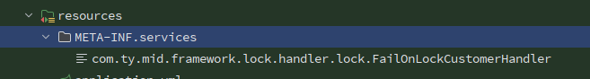
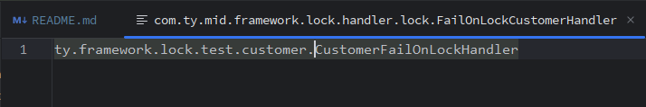

<!-- TOC -->
* [项目特点](#项目特点)
* [一:框架集成](#一框架集成)
  * [1.引入核心依赖](#1引入核心依赖)
  * [2.使用redis厂商lock默认实现Redisson](#2使用redis厂商lock默认实现redisson)
  * [3.使用zookeeper厂商lock](#3使用zookeeper厂商lock)
* [二:api调用示例](#二api调用示例)
* [三:注解支持](#三注解支持)
  * [1.注解介绍](#1注解介绍)
  * [2.注解使用示例](#2注解使用示例)
* [四:lock增强](#四lock增强)
* [五:全局锁降级](#五全局锁降级)
* [六:配置](#六配置)
  * [1.配置清单](#1配置清单)
  * [2.具体配置介绍](#2具体配置介绍)
* [七:CUSTOMER的SPI扩展示例](#七customer的spi扩展示例)
  * [1.SPI扩展点](#1spi扩展点)
  * [2.使用示例](#2使用示例)
<!-- TOC -->


开源地址:https://github.com/2892824942/ty-cloud/blob/main/ty-framework/ty-framework-lock

# 项目特点
1. 集成分布式锁能力,starter依赖即可使用分布式锁能力
2. 抽象分布式锁的集成，方便快速切换分布式锁方案(目前支持jvm,redis,zookeeper)
3. 锁的调用基于spring lockRegistry以及java lock顶层接口，调用统一,支持多厂商实现(可同时使用),支持切换,支持扩展,
4. 支持多种锁类型,可重入锁,读锁,写锁等
5. 提供注解方式支持,并提供更强大方便的能力
6. lock能力增强,支持本地预锁,事务感知,死锁检测
7. 提供方法级定制以及全局定制能力

# 一:框架集成

## 1.引入核心依赖
暂时未发到中央仓库(准备中)...
```xml

<dependency>
    <groupId>com.ty</groupId>
    <artifactId>ty-framework-lock-starter</artifactId>
    <version>${最新版本}</version>
</dependency>

```

## 2.使用redis厂商lock默认实现Redisson

```xml

<dependency>
    <groupId>org.redisson</groupId>
    <artifactId>redisson-spring-boot-starter</artifactId>
    <version>3.18.0</version>
</dependency>
```

## 3.使用zookeeper厂商lock

```xml

<dependency>
    <groupId>org.apache.curator</groupId>
    <artifactId>curator-recipes</artifactId>
    <version>3.18.0</version>
</dependency>
```

以上2,3配置可选一种,如有需要可同时使用,注意

- 使用redis方式需要按照spring-boot配置好redis的配置
- 使用zookeeper方式,框架提供zookeeper快速集成配置,配置demo如下

```yaml
framework:
  zookeeper:
    address: 127.0.0.1:2181 #zookeeper连接地址
    connection-time-out: 10000 #连接超时时间 毫秒
    session-time-out: 10000 #session超时时间 毫秒
    sleep-time-out: 3000 #重试初试时间 毫秒
    max-retries: 3 #重试次数
    name-space: curator #命名空间
```

# 二:api调用示例

```java

@Service
public class TestService {
    @Autowired
    private LockRegistry lockRegistry;

    public void testLock(Long id) {
        Lock lock = lockRegistry.obtain(id.toString());
        try {
            boolean result = lock.tryLock();
            if (result) {
                //do your business code
            }
        } finally {
            //一定要放到finally中执行
            lock.unlock();
        }
    }
}

```

锁的获取使用Spring定义的lockRegistry,锁对象使用java定义的Lock接口

# 三:注解支持

## 1.注解介绍

| 注解            | 简介                   |
 |---------------|----------------------|
| @FailFastLock | 快速失败的lock            |
| @LocalLock    | JVM实现的lock           |
| @AntiReLock   | 防重锁,用于业务防止重复访问       |
| @Lock         | 顶层lock注解，支持所有策略及配置参数 |

- @FailFastLock,@LocalLock,@AntiReLock 都是基于@Lock实现的，扩展注解主要是为了更好的语义以及使用体验，而无需指定多余的配置。比如@FailFastLock不用配置等待时间，等待时间是0
- @AntiReLock 用于业务防止重复访问默认情况下与@FailFastLock能力一致,特别的:支持设置等待时间和异常message,并支持全局的AntiReLockMsg

## 2.注解使用示例

```java

import com.ty.mid.framework.lock.annotation.LockKey;

@Service
public class TestService {
    @Autowired
    private LockRegistry lockRegistry;

    @FailFastLock(keys = "#id")
    public void testLock1(Long id) {
        //do your business code
    }

    //以下代码和上方代码等同
    @FailFastLock
    public void testLock2(@LockKey Long id) {
        //do your business code
    }
}

```
具体示例见:lock-starter模块中的test
注意,和spring等其他注解(如@Transaction)一样,基于界面实现的代码增强调用lock标注的方法必须使用代理对象,使用this.testLock1(id)调用注解不生效

# 四:lock增强

- 本地预锁
  在分布式锁使用前增加jvm lock逻辑,适用于锁竞争较大场景.具体见withLocalCache配置

- 事务感知
  当lock存在于事务上下文中的策略,此情况发生时,会导致lock释放时,事务还未释放,从而导致锁不住的问题.具体见transactionStrategy配置

- 死锁检测
  可检测代码中可能出现的死锁场景,只是检测,并不一定会出现,仅做参考使用(建议勿在生产开启).具体见cycleLockStrategy配置

# 五:全局锁降级

全局的implementer配置可实现全局锁降级策略,可选择平移至其他分布式锁实现,也可降级为jvm实现,保证业务可用

# 六:配置

## 1.配置清单

|             配置名              | 配置简介                              | 默认值                                            | 作用域   | 说明                                                                      |
|:----------------------------:|-----------------------------------|------------------------------------------------|:------|-------------------------------------------------------------------------|
|            enable            | 是否开启                              | Boolean.TRUE                                   | 全局    | 全局开关                                                                    |
|         implementer          | ock厂商实现类型                         | LockImplementer.REDIS                          | 全局及注解 | 可选:REDIS,ZOOKEEPER,JVM                                                  |
|             type             | lock 的类型                          | LockType.Reentrant                             | 全局及注解 | 可选:Reentrant,Fair,Read,Write                                            |
|             keys             | 自定义业务key                          | 无                                              | 仅注解   | 支持SpingEL                                                               |
|             name             | 锁的名称                              | 无                                              | 全局    | 见具体解释                                                                   |
|           waitTime           | 获取锁等待时间                           | 2s                                             | 全局及注解 | 锁获取不到时最大等待时间                                                            |
|          leaseTime           | 最大持有时间                            | 60s                                            | 全局及注解 | java Lock Api并没有定义，但像Redisson方言实现中有对应的定义,如想要使用此参数,开启dialect配置生效         |
|       lockFailStrategy       | 加锁失败的处理策略                         | FailOnLockStrategy.FAIL_FAST                   | 全局及注解 | 可选:NO_OPERATION,THROWING,KEEP_ACQUIRE,CUSTOMER                          |
|   exceptionOnLockStrategy    | 加锁异常的处理策略                         | ExceptionOnLockStrategy.THROW_EXCEPTION        | 全局及注解 | 可选:THROWING,CUSTOMER                                                    |
|   releaseExceptionStrategy   | 释放锁时异常的处理策略                       | ReleaseTimeoutStrategy.FAIL_FAST               | 全局及注解 | 可选:THROWING,KEEP_ACQUIRE,CUSTOMER                                       |
|        exceptionClass        | 获取锁失败时，报错的异常类型                    | LockException                                  | 全局及注解 | 见具体解释                                                                   |
|         exceptionMsg         | 获取锁失败时，报错的错误信息                    | Failed to acquire Lock(%s) with timeout(%d ms) | 全局及注解 | 见具体解释                                                                   |
|    customLockFailStrategy    | 定制的加锁失败的处理策略                      | 无                                              | 全局及注解 | 与lockFailStrategy中的CUSTOM不同点：此方式可对方法具体参数做定制化的处理策略，后者更适合做全局的默认处理         |
| customReleaseTimeoutStrategy | 定制的释放锁时异常的处理策略                    | 无                                              | 全局及注解 | 与releaseTimeoutStrategy中的CUSTOM不同点在于：此方式可对方法具体参数做定制化的处理策略，后者更适合做全局的默认处理 |
|        withLocalCache        | 是否支持本地预锁                          | Boolean.FALSE                                  | 全局及注解 | 增强能力:本地预锁                                                               |
|     transactionStrategy      | 是否支持事务感知                          | LockTransactionStrategy.DISABLED               | 全局    | 增强能力:事务感知,可选值:WARMING,THROWING,THREAD_SAFE,DISABLED                     |
|      cycleLockStrategy       | 死锁探测                              | LockTransactionStrategy.DISABLED               | 全局    | 增强能力:死锁探测,可选值: WARMING,THROWING,DISABLED                                |
|           dialect            | 方言开关                              | Boolean.False                                  | 全局    | api及注解支持方言,如redisson的最大持有锁时间                                            |
|        antiReLockMsg         | 获取锁失败时，报错的错误信息(仅针对@AntiReLockMsg) | Boolean.False                                  | 全局及注解 | 优先级:注解exceptionMsg>全局antiReLockMsg>全局exceptionMsg>系统默认                  |
|        lockNamePrefix        | 锁name的前缀                          | lock                                           | 全局    | 生成的锁的name的前缀                                                            |
|      lockNameSeparator       | 锁key的连接符                          | :                                              | 全局    | key组合name时,多个key及前缀之间的连接符                                               |

## 2.具体配置介绍

前言:
所有的配置项,当作用域为全局及注解时,注解的优先级大于全局配置

- keys及name
  框架会按照${lockNamePrefix}:${name}:${key1}:...:${keyN}:${@LockKey1}:...:${@LockKeyN}的方式拼接，作为lock的LockId.中间的连接符":"也可通过lockNameSeparator配置自定义

特殊的:
当lockNamePrefix为空时，LockId=${name}:${key1}:...:${keyN}:${@LockKey1}:...:${@LockKeyN}
当name，keys以及注解@LockKey都为空时，系统默认使用方法的全限定类名作为key（不推荐使用此方式,会增加存储成本）

- transactionStrategy
  当lock存在于事务上下文中的策略,此情况发生时,会导致lock释放时,事务还未释放,从而导致锁不住的问题,可选策略

```
WAARMING  打warming日志
FORBIDDEN 禁止，会抛出异常阻断业务逻辑
THREAD_SAFE 保证多线程访问安全，unlock会在事务完成后再提交。缺点：会使lock的作用域膨胀。直至上下文事务完成
```

- leaseTime
  java Lock Api并没有定义，但像Redisson方言实现中有对应的定义,框架兼容了方言特殊的api,如需使用参数,开启dialect配置.开启后api及注解全部生效

- exceptionClass及exceptionMsg
  获取锁失败时，报错的异常类型
  a.仅当LockFailStrategy.FAIL_FAST或者ReleaseTimeoutStrategy.FAIL_FAST 生效 此处设置二者都会生效
  b.优先级：注解exceptionClass>全局exceptionClass>系统默认
  c.注意：必须是RuntimeException的子类

- lockFailStrategy
  加锁失败的处理策略：

```
NO_OPERATION：继续执行业务逻辑，不做任何处理
FAIL_FAST：快速失败
KEEP_ACQUIRE：一直阻塞，直到获得锁，在太多的尝试后，仍会报错
CUSTOMER： 自定义，用于全局默认处理
```

其他锁过程处理Strategy类似,不再赘述

# 七:CUSTOMER的SPI扩展示例

## 1.SPI扩展点

以上的策略中，lockFailStrategy，lockExceptionStrategy，releaseTimeoutStrategy
都提供了CUSTOMER的的策略，框架通过java的SPI机制，将对应的用户自实现的策略加载

| 策略点        | 策略名                    | 具体配置名    | 扩展定义接口                                                                |
|------------|------------------------|----------|-----------------------------------------------------------------------|
| 加锁失败的处理策略  | lockFailStrategy       | CUSTOMER | com.ty.mid.framework.lock.handler.lockExceptionOnLockCustomerHandler  |
| 加锁异常的处理策略  | lockExceptionStrategy  | CUSTOMER | com.ty.mid.framework.lock.handler.lock.ExceptionOnLockCustomerHandler |
| 释放锁异常的处理策略 | releaseTimeoutStrategy | CUSTOMER | com.ty.mid.framework.lock.handler.lock.ReleaseTimeoutCustomerHandler  |

## 2.使用示例

这里以ExceptionOnLockCustomerHandler 作为示例
（1）在resources文件夹下创建文件夹META-INF/services



(2)在META-INF/services中添加file，名称为扩展的Handler的全限定类名

(3)文件中填写自己基于定义的接口的实现类的全限定类名



自定义处理策略加载后，如果需要指定为全局，需要在全局配置中指定定位的策略名的配置为CUSTOMER即可开启，方法级（或者注解）同理
注意：无论是全局还是注解的方法级，一旦指定以上策略的配置为CUSTOMER，则系统运行时必须存在对应的实现类，否则报错。不同的是，全局级配置报错将导致项目无法启动

