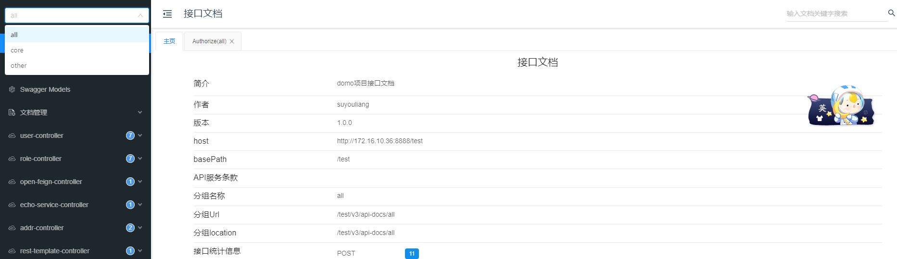

<!-- TOC -->

* [项目特点](#项目特点)
* [一:框架集成](#一框架集成)
    * [1.引入核心依赖](#1引入核心依赖)
    * [2.配置相关功能](#2配置相关功能)
* [二:功能介绍](#二功能介绍)
    * [1.swagger支持并提供swagger快速配置](#1swagger支持并提供swagger快速配置)
    * [2.knife增强swagger支持](#2knife增强swagger支持)
    * [3.全局请求参数校验(Validation)支持](#3全局请求参数校验validation支持)
    * [4.字段脱敏支持](#4字段脱敏支持)
    * [5.默认jackson序列化](#5默认jackson序列化)
    * [6.xss,cors支持](#6xsscors支持)
    * [7.访问日志支持](#7访问日志支持)
    * [8.全局异常处理,统一返回结果](#8全局异常处理统一返回结果)
    * [9.系统关键及常用信息启动显示](#9系统关键及常用信息启动显示)

<!-- TOC -->

开源地址:https://github.com/2892824942/ty-cloud/blob/main/ty-framework/ty-framework-service

# 项目特点

- 自动集成spring-boot-web模块
- swagger支持并提供swagger快速配置
- knife增强swagger支持
- 全局请求参数校验(Validation)支持
- 字段脱敏支持
- 默认jackson序列化
- xss支持
- cors支持
- 访问日志支持
- 全局异常处理,统一返回结果
- 系统关键及常用信息启动显示

# 一:框架集成

## 1.引入核心依赖

暂时未发到中央仓库(准备中)...

```xml

<dependency>
    <groupId>com.ty</groupId>
    <artifactId>ty-framework-web-starter</artifactId>
    <version>${最新版本}</version>
</dependency>

```

## 2.配置相关功能

```yaml
#以下功能按需配置
framework:
  web:
  #注意:开启此配置后,custom-api中的controller将会全部增加prefix访问前缀
  enable-mvc-url-prefix: true
  custom-api:
    core:
      prefix: /core
      controller: '**.web.**'
    other:
      prefix: /
      controller: '**'
  xss:
    enable: true
  #hashId配置
  hash-id:
    enable: true
    min-length: 4
    salt: 'test111'
  enable-cors: true
  swagger:
    author: 大壮
    version: 1.0.0
    description: domo项目接口文档
    title: 接口文档
    url: http://127.0.0.1:8080/swagger-ui/index.html
    license-url: license-url
    email: 282824942@qq.com
```

# 二:功能介绍

## 1.swagger支持并提供swagger快速配置


- swagger配置

```yaml
framework:
  swagger:
  author: suyouliang
  version: 1.0.0
  description: domo项目接口文档
  title: 接口文档
  url: http://127.0.0.1:8080/swagger-ui/index.html
  license-url: license-url
  email: test@qq.com
```

- WebConfig配置

```yaml
framework:
  web:
  custom-api:
    core:
      prefix: /core
      controller: '**.web.**'
    other:
      prefix: /
      controller: '**'
```

custom-api下可以配置多个分组,,每个分组将自动在swagger中生成一个分组

prefix按照前缀匹配

如没有统一前缀,可手动加上前缀或开启enable-mvc-url-prefix配置,开启后,会在controller的访问路径自动加上prefix

## 2.knife增强swagger支持

knife需要手动开启:

```yaml
#knife4j相关配置,swagger增强
knife4j:
  enable: true
  setting:
    language: zh_cn
```

knife界面:


## 3.全局请求参数校验(Validation)支持

新增
具体使用方式不在赘述,和官网无差别.

新增@InEnum,@Mobile,@Telephone注解,用于校验枚举,手机号,电话号码

## 4.字段脱敏支持

- 单向字段脱敏:
  银行卡,车牌号,中文名字,邮箱,手机号,电话号码,身份证号,密码等注解

- 双向字段脱敏:
  有的业务场景,不希望自增的id直接返回前端导致业务暴露或者其他安全目的.可以使用@HashedId注解
  @HashedId注解可自动在序列化时将id进行脱敏处理,接受时进行还原处理

使用示例

在实体类中标记

```java
//在实体类中标记
public class AddrVO implements BaseIdDO<Long> {

  private static final long serialVersionUID = 1L;

  @Schema(description = "id")
  @HashedId
  private Long id;

}
```

在参数上标记

```java

public class UserController {

    @Resource
    private IUserService userService;

    @GetMapping("/getById")
    public BaseResult<UserFullDTO> getById(@HashedId Long id) {
        return BaseResult.success(userService.getById(id));
    }
}
```

## 5.默认jackson序列化

自动集成jackson进行序列化

- 解决数值超过 2^53-1，在 JS 会出现精度丢失问题
- 解决日期格式问题,Date及LocalDateTime兼容,且支持spring.jackson.date-format配置
- 增加localDate,LocalTime序列化

## 6.xss,cors支持

需要开启如下配置

```yaml
framework:
  xss:
    enable: true
    #排除哪些url不走xss过滤
    exclude-urls: "/test/**","/ops/**"
  enable-cors: true
```

## 7.访问日志支持

spring web接口访问过程,通过filter将访问及返回的上下文信息整理,并通过springEvent事件广播,可自定义进行处理

以下是监听对应事件简单打印log

```java
@Component
@Slf4j
public class ApiLogListener {

    @EventListener
    public void onApiAccessLogEvent(ApiAccessLogEvent event) {
        log.info("api access log eventData: \r\n{}", JsonUtils.toJson(event.getSource()));
    }

    @EventListener
    public void onApiErrorLogEvent(ApiErrorLogEvent event) {
        log.error("api error log eventData: {}", JsonUtils.toJson(event.getSource()));
    }
}
```

## 8.全局异常处理,统一返回结果

具体见:BaseResult,GlobalExceptionHandler

## 9.系统关键及常用信息启动显示


更详细的使用案例,见:https://github.com/2892824942/framework-demo
